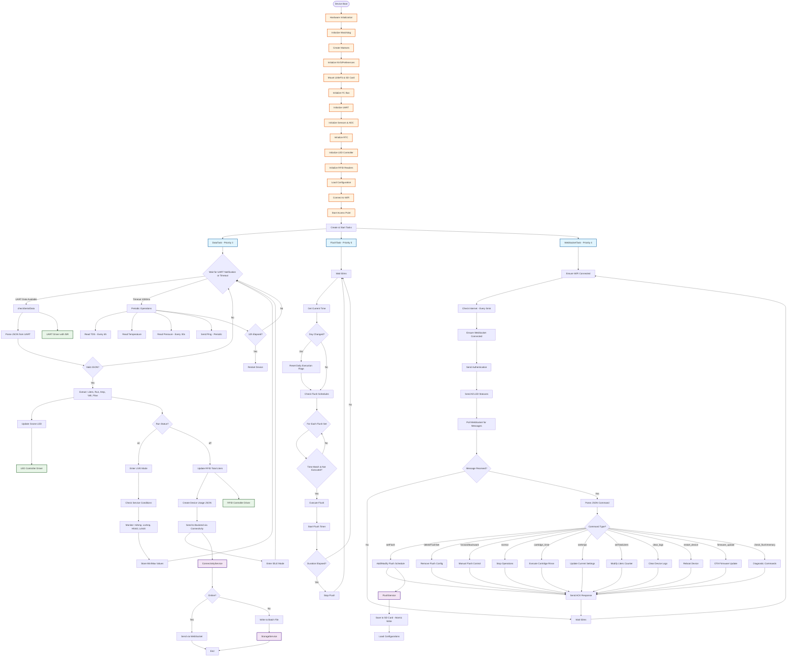

# 🌊 iCleanLines Board Program Firmware

<div align="center">


**🚀 Production-Ready IoT Water Management System**

</div>

---

## 🎯 Overview

This repository contains the **high-performance firmware** for the iCleanLines IoT device, built using the **PlatformIO framework** for the **ESP32 microcontroller**.

> 💡 **Smart Design**: The system is architected as a robust, connected device that manages and monitors "flush" cycles with real-time communication, offline resilience, and a sleek web-based configuration portal.

The application logic runs on **FreeRTOS** for responsive and concurrent handling of multiple tasks, ensuring **enterprise-grade reliability** in production environments.

---

## ✨ Key Features

| Feature | Description | Status |
|---------|-------------|--------|
| 📶 **WiFi Connectivity** | Seamless connection to local networks with auto-reconnection | ✅ Active |
| 🌐 **Web Configuration Portal** | Intuitive setup interface for WiFi credentials and device configuration | ✅ Active |
| ⚡ **Real-time Communication** | WebSocket-based instant bidirectional communication with backend | ✅ Active |
| 💾 **Offline Data Caching** | Smart batch storage to SD card when network is unavailable | ✅ Active |
| 🔄 **Automatic Data Sync** | Intelligent sync of cached data when connectivity is restored | ✅ Active |
| 🚿 **Flush Cycle Management** | Sophisticated scheduling engine for automated and manual flush cycles | ✅ Active |
| 🔧 **Hardware Control** | Advanced drivers for RFID readers, UART communication, and LED indicators | ✅ Active |
| ⚙️ **RTOS Architecture** | Multi-tasking foundation ensuring stable parallel execution | ✅ Active |

---

## 🏗️ System Architecture and Flow

The firmware operates in a **sophisticated multi-tasking environment**, with distinct components handling different aspects of functionality:

### 🚀 Initialization Sequence (`setup()`)

The device follows a **carefully orchestrated boot sequence**:

> **🔧 Phase 1: Hardware Foundation**
> - Initialize core GPIO pins and serial communication
> - Set up watchdog timers and system mutexes

> **💾 Phase 2: Storage & Configuration**  
> - Mount local filesystem (SD card/LittleFS)
> - Load saved flush schedules and device configurations

> **🌐 Phase 3: Connectivity Setup**
> - Attempt connection to known WiFi networks
> - Fall back to Access Point mode with captive portal
> - Serve configuration web interface at `data/wifi_config.html`

> **⏰ Phase 4: Time Synchronization**
> - Connect to NTP servers for accurate timekeeping
> - Essential for scheduled flush operations

> **🎯 Phase 5: Task Deployment**
> - Create and launch the three main RTOS tasks
> - Begin concurrent operation mode

### 🔄 Concurrent Task Architecture

The system runs **three specialized RTOS tasks** working in harmony:

#### 📊 **`data_task`** - *The Data Intelligence Hub*
- 🎧 **UART Listener**: Event-driven processing of external device data
- 🏷️ **RFID Interface**: Smart tag detection and liters tracking  
- 📡 **Data Pipeline**: JSON formatting and transmission via ConnectivityService

#### 🌐 **`websocket_task`** - *The Communication Gateway*
- 🔗 **Connection Manager**: Maintains persistent WebSocket links
- 📨 **Command Processor**: Handles real-time server commands
- 📤 **Status Broadcaster**: Pushes live updates and events

#### 🚿 **`flush_task`** - *The Automation Engine*
- 📅 **Schedule Manager**: Executes time-based flush cycles
- 🎮 **Manual Control**: Handles immediate flush commands
- ⏱️ **Duration Control**: Precise timing for flush operations

### 🛠️ Core Service Layer

**High-level services** provide robust functionality across the system:

#### 🌐 **`ConnectivityService`** 
> 📡 *Your network command center*
> - Smart routing: Online = immediate WebSocket, Offline = batch storage
> - Auto-reconnection logic with exponential backoff
> - Connection health monitoring

#### 💾 **`StorageService`**
> 🗃️ *Your data persistence guardian*
> - Atomic file operations with crash protection
> - Unified API for configuration and data batching
> - SD card + LittleFS hybrid storage

#### 🚿 **`FlushService`**
> ⏰ *Your scheduling mastermind*
> - Complex schedule parsing and validation
> - Persistent configuration with atomic saves
> - Real-time execution coordination

---

## 📁 Project Structure

```
📦 icleanlines-pio/
├── 🌐 data/                    # Web portal assets
│   ├── 🏠 setup.html          # Main configuration interface  
│   └── 📶 wifi_config.html    # WiFi setup wizard
├── ⚙️ platformio.ini           # Build configuration & dependencies
└── 💻 src/                     # Core firmware source
    ├── 🚀 main.cpp             # System entry point & initialization
    ├── 🌍 app/                 # Global state management
    ├── 🔧 config/              # Hardware & network configurations
    ├── 🛠️ core/                # Logging & RTOS utilities
    ├── 🔌 drivers/             # Hardware abstraction layer
    │   ├── 💡 led/             # LED controller & effects
    │   ├── 🏷️ rfid/            # RFID reader management
    │   ├── 🌡️ sensors/         # Environmental sensors
    │   └── 📡 uart/            # Serial communication
    ├── 🌐 services/            # Business logic services
    │   ├── 📶 connectivity/    # Network & WebSocket management
    │   ├── 🚿 flush/           # Flush scheduling & execution
    │   ├── 💾 storage/         # File system operations
    │   └── ⏰ time/            # NTP & RTC management
    ├── 🔄 tasks/               # FreeRTOS task definitions
    └── 📋 types/               # Custom data structures
```

---

## 🛠️ Quick Start Guide

### 📋 Prerequisites
- 🔧 [PlatformIO IDE](https://platformio.org/platformio-ide) extension for VS Code
- 🔌 USB cable for ESP32 connection
- 💻 Windows/Mac/Linux development machine

### 🚀 Build & Deploy

<div align="center">

| Step | Action | Command |
|------|--------|---------|
| 1️⃣ | **Connect Device** | Plug ESP32 via USB |
| 2️⃣ | **Build Firmware** | `platformio run` |
| 3️⃣ | **Flash Device** | `platformio run --target upload` |
| 4️⃣ | **Monitor Logs** | `platformio device monitor` |

</div>

> 💡 **Pro Tip**: Use the PlatformIO toolbar in VS Code for one-click operations!

---

## 🎯 Task Architecture Deep Dive

<div align="center">

**🔥 Three High-Performance FreeRTOS Tasks Working in Perfect Harmony**

</div>

### 📊 `DataTask` (Priority: 3, Stack: 8KB)
> **🎯 Mission**: *Data collection, processing, and system health monitoring*

<details>
<summary><strong>🔍 Key Responsibilities</strong></summary>

#### 📡 **UART Data Processing**
- 🎧 Event-driven listener for external device communications
- 📋 Parses structured JSON containing:
  - 🌊 Flow rate (L/min)
  - ⚡ Current & Set Current (Amp/SetAmp)  
  - 🔋 Voltage levels
  - 💧 Liters consumed
  - 🔄 Run status ("on"/"off")
  - ⏱️ Operating duration

#### 🎛️ **System State Management**
- 🟢 **LIVE Mode**: Active operation monitoring
- 🔴 **IDLE Mode**: Standby with timeout protection

#### 🚨 **Service Condition Monitoring**
- ⚠️ High current detection (≥ 1.75 × SetAmp)
- ⚠️ Low current alerts (≤ 0.4 × SetAmp)
- 🔋 Voltage monitoring (< 5.5V or > 26V)
- 💡 Auto-service LED activation

#### 🏷️ **RFID Integration**
- 📝 Real-time liters tracking on smart tags
- 🔄 Automatic updates on cycle completion

#### 📈 **Periodic Health Checks**
- 🧪 TDS monitoring (every 6 hours)
- 🌡️ Temperature sensor readings
- 💨 Pressure monitoring (every 30 seconds)
- 💓 Backend heartbeat pings
- 🔄 Auto-restart (every 12 hours)
- 🐕 Watchdog integration

</details>

### 🚿 `FlushTask` (Priority: 5, Stack: 4KB)
> **🎯 Mission**: *Automated flush cycle execution and schedule management*

<details>
<summary><strong>🔍 Key Responsibilities</strong></summary>

#### 📅 **Schedule Management**
- ⏰ Real-time schedule monitoring
- 🔄 Daily execution flag resets
- 📋 Multi-schedule coordination

#### 🎮 **Execution Control**
- 🚀 Precise flush triggering
- ⏱️ Duration management with auto-stop
- 🎯 Manual override support

#### 📊 **State Tracking**
- 🔄 FlushState management (NONE/FORWARD/BACKWARD)
- 📈 Performance metrics collection

**⚡ Performance**: *50ms cycle time for maximum responsiveness*

</details>

### 🌐 `WebSocketTask` (Priority: 4, Stack: 6KB)
> **🎯 Mission**: *Real-time bidirectional communication with backend server*

<details>
<summary><strong>🔍 Key Responsibilities</strong></summary>

#### 🔗 **Connection Management**
- 📶 WiFi connectivity with smart reconnection
- 🌐 WebSocket persistence management  
- 🌍 Internet health checks (every 5 minutes)

#### 🔐 **Authentication & Security**
- 🆔 Device identification protocol
- 🔒 Secure session management

#### 📨 **Command Processing Hub**
- 🚿 `setFlush` - Schedule management
- 🗑️ `deleteFlushSet` - Configuration cleanup
- ▶️ `forward/backward` - Manual controls
- ⏹️ `normal` - Operation stops
- 🧽 `cartridge_rinse` - Maintenance cycles
- ⚡ `setAmps` - Power configuration
- 💧 `setTotalLiters` - Counter management
- 📝 `clear_logs` - System cleanup
- 🔄 `restart_device` - Remote reboot
- 📦 `firmware_update` - OTA updates
- 🔍 `check_flush/memory` - Diagnostics

#### 📡 **Status Broadcasting**
- 💡 LED status synchronization
- ✅ Command acknowledgments
- 📊 Real-time telemetry

#### 🛡️ **Safety Systems**
- 🚫 Prevents config changes during active operations
- 🔒 Operation state validation

**⚡ Performance**: *50ms polling with continuous WebSocket monitoring*

</details>

### 🧪 Local Testing with wscat

> **🎯 Test your WebSocket commands like a pro!**

#### 📦 Installation
```bash
npm install -g wscat
```

#### 🔗 Connection
```bash
wscat -c ws://localhost:8090
```

<details>
<summary><strong>📋 Sample Commands (Click to expand)</strong></summary>

```json
// 🔐 Authentication (required first)
{
  "type": "auth",
  "deviceId": "your-device-id"
}

// ▶️ Manual flush forward
{
  "type": "command",
  "deviceId": "your-device-id",
  "cmd": "forward"
}

// ◀️ Manual flush backward
{
  "type": "command",
  "deviceId": "your-device-id",
  "cmd": "backward"
}

// ⏹️ Stop operations (normal mode)
{
  "type": "command",
  "deviceId": "your-device-id",
  "cmd": "normal"
}

// ⚡ Update current settings with forward/backward/normal amps
{
  "type": "command",
  "deviceId": "your-device-id",
  "cmd": "setAmps",
  "params": {
    "forward": 4,
    "backward": 3,
    "normal": 1
  }
}

// 📅 Set flush schedule
{
  "type": "command",
  "deviceId": "your-device-id",
  "cmd": "setFlush",
  "identifier": "daily-flush",
  "flushes": [
    {
      "time": "08:00",
      "duration": 30,
      "days": [1, 2, 3, 4, 5]
    }
  ]
}

// 🗑️ Delete flush set
{
  "type": "command",
  "deviceId": "your-device-id",
  "cmd": "deleteFlushSet",
  "identifier": "daily-flush"
}

// 💧 Set total liters
{
  "type": "command",
  "deviceId": "your-device-id",
  "cmd": "setTotalLiters",
  "liters": 1000.0
}

// 🧽 Cartridge rinse
{
  "type": "command",
  "deviceId": "your-device-id",
  "cmd": "cartridge_rinse"
}

// 📝 Clear logs
{
  "type": "command",
  "deviceId": "your-device-id",
  "cmd": "clear_logs"
}

// 🔍 Check flush status
{
  "type": "command",
  "deviceId": "your-device-id",
  "cmd": "check_flush"
}

// 💾 Check memory status
{
  "type": "command",
  "deviceId": "your-device-id",
  "cmd": "check_memory"
}

// 🔄 Restart device
{
  "type": "command",
  "deviceId": "your-device-id",
  "cmd": "restart_device"
}

// 📦 Firmware update
{
  "type": "command",
  "deviceId": "your-device-id",
  "cmd": "firmware_update",
  "file": "https://example.com/firmware.bin"
}
```

</details>

#### 📡 Response Formats

<details>
<summary><strong>✅ Success Response</strong></summary>

```json
{
  "type": "ack",
  "messageId": "auto-generated-id",
  "deviceId": "your-device-id", 
  "cmd": "forward",
  "status": "ok"
}
```

</details>

<details>
<summary><strong>❌ Error Response</strong></summary>

```json
{
  "type": "ack",
  "messageId": "auto-generated-id",
  "deviceId": "your-device-id",
  "cmd": "forward", 
  "status": "error",
  "error": "Device is already flushing"
}
```

</details>

---

## 📊 System Flow Diagram

<details>
<summary><strong>🎯 Click to view the complete system architecture flowchart</strong></summary>



</details>

---

<div align="center">

## 🎉 You're All Set!

**Ready to build the future of IoT water management?**


**🚀 Happy Coding!**

</div>
